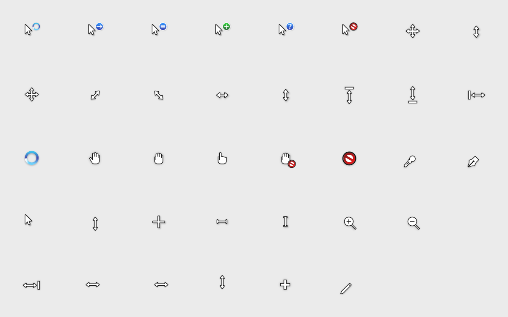
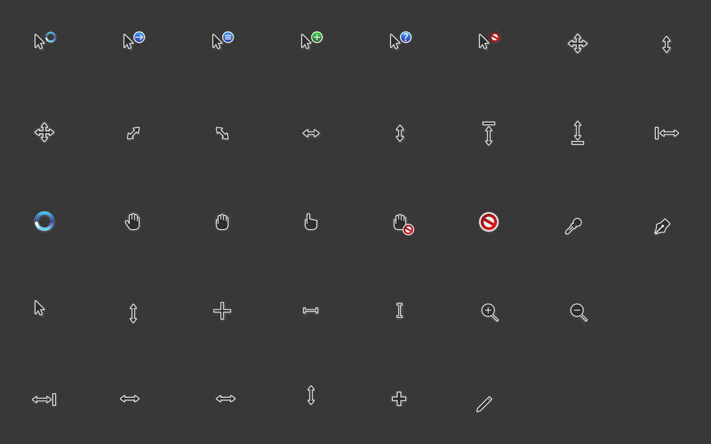

# Win7Bulid Cursors

An xcursor theme inspired by Windows 7, based on [capitaine-cursors](https://github.com/keeferrourke/capitaine-cursors).

**Two variants** of the same cursor set are provided:

| Variant | Build output | Name in settings | Install folder |
|---------|--------------|------------------|----------------|
| Light | `dist/` | Win7Bulid Cursors | `Win7Bulid-cursors` |
| Dark | `dist-dark/` | Win7Bulid Cursors Dark | `Win7Bulid-cursors-dark` |

### Dark variant behavior

Monochrome cursor art is recolored for dark backgrounds: fill `#ffffff` / `#fff` → `#2d2d2d`, outlines `#151515` → `#e8e8e8` (including inline `style="fill:#…"` where used, e.g. pencil, zoom icons).

**Exceptions (unchanged or partial):**

| Cursors | What stays light-theme |
|---------|-------------------------|
| `wait`, `wait-*` | Entire cursor |
| `progress`, `progress-*` | Blue spinner only; **pointer arrow** is dark |
| `help`, `copy`, `alias`, `context-menu`, `no-drop` | Colored badges; **main arrow** is dark |
| `not-allowed` | White disc + red “no” symbol; outer ring uses light outline |
| `dnd-no-drop` | Badge white disc + red symbol; **hand** is dark |

Source SVG for the dark theme is generated into `src/svg-dark/` by `src/make-dark-arrow-variant.py`.

## Preview

### Win7Bulid Cursors (light)



### Win7Bulid Cursors Dark



Previews are written by `./build.sh` via `src/generate-preview.py` from `src/pixmaps/light/x1_5` and `src/pixmaps/dark/x1_5`.

## Installation

Current user (both variants):

```
./install.sh
```

System-wide:

```
sudo ./install.sh
```

Then pick the theme in your desktop settings (KDE, GNOME, …).

## Building from source

SVG sources and `.cursor` configs are under `src/`. Run:

```
./build.sh
```

This will:

1. Render light pixmaps from `src/svg` (Inkscape) or reuse committed PNGs under `src/x1*` if Inkscape is missing.
2. Build `dist/` with `xcursorgen`.
3. Build `src/svg-dark/`, render dark pixmaps to `src/pixmaps/dark/`, and build `dist-dark/`.
4. Regenerate `preview-light.png`, `preview-dark.png`, and `preview.png`.

Dark PNGs without Inkscape: copied from light pixmaps and adjusted with `src/make-dark-arrow-png.py` (prohibition badges preserve red/white where possible).

**Verify:** `python3 src/test-dark-variant.py` (run after `./build.sh`).

**Dependencies:**

- **`xcursorgen`** — required to produce installable `dist/` and `dist-dark/` (e.g. `xcursor` on openSUSE). If absent, the script still updates pixmaps and previews but skips theme generation.
- **`inkscape`** — strongly recommended so dark cursors match `svg-dark` (otherwise PNG fallback is used).
- **Python 3** with **Pillow** — previews and tests.

## License

See [LICENSE](LICENSE).
